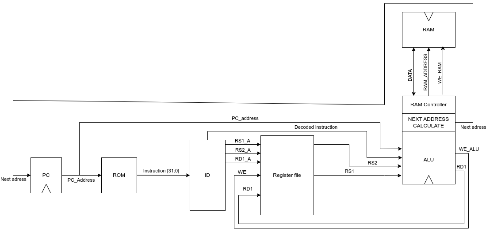

 # Архитектура репозитория
- src/            - исходный код компонентов ядра;
- src/firmware/   - hex-файлы прошивки;
- testbench/      - исходный код тестовых окружений;
- images/         - Картинки используемые в репозитории;
- result_vcd/     - Папка с выходными файлами симулятора;
- makefile        - сборщик проекта.

# Описание репозитория

В репозитории представлена реализация процессора из книги "Цифровой синтез RISC-V" под редакцией Ю. Романова. 

В книге реализован упрощенный вариант RISC-V процессора с минимальным набором ассемблерных команд, которых достаточно для назождения квадратного корня. В процессе реализации было решено расширить используемый набор команд до стандартного набора инструкций RV32I без учета функции системного вызова **ecall** и системного останова **ebreak**.  

Получившаяся архитектура ядра:

# Программное окружение

|       Наименование:       |           Значение:         |
|---------------------------|-----------------------------|
|   Операционная система    |   Elementary OS 7.1 Horus   |
|   Компилятор/Симулятор    |        Vivado 2021.1        |
| Просмотр выходных файлов  | GTK-Wave Analyzer v.3.3.104 |

